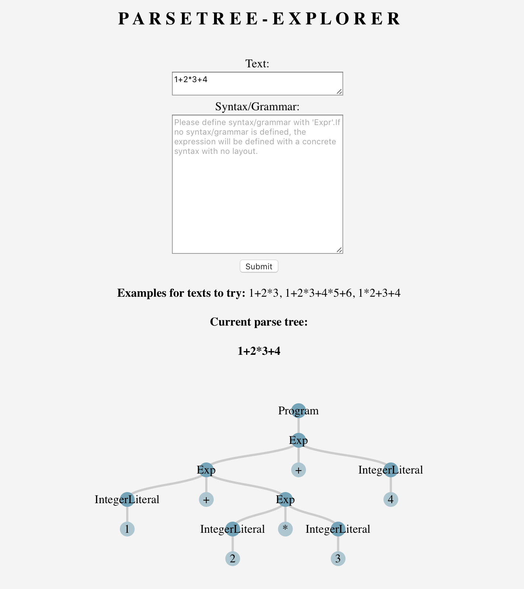

# Parse Tree Explorer

Eclipse IDE 2020-03 R Package

## What is it?
Web application that lets users explore syntax/grammars and see the visualized parse tree.

## How to run
- Run the module `runApp.rsc` placed in `webapp` as a Rascal application
- Open http://localhost:10001/ on a browser

It should look something like this:

## Must manually shut down the server when done
- Write this on Rascal terminal:  
  - `import util::Webserver;`
  - `import Content;`
  - `shutdown(|http://localhost:10001|);`
  
Or if by any chance that does not work:  
For macOS/Linux
- To track down the server: `sudo lsof -iTCP:10001 -sTCP:LISTEN`
- Now you see the process ID, kill it: `kill 12017` (or whatever the PID is)  

For Windows
- To track down the server: `netstat -ano | findstr :10001` (the port number)
- Now you see the process ID, kill it: `taskkill /F /PID 12017` (or whatever the PID is)
